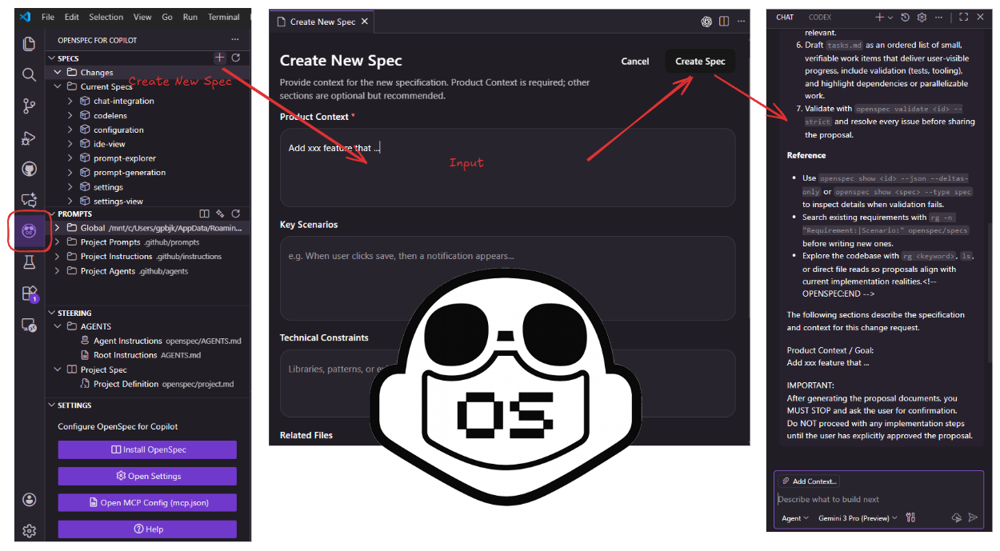
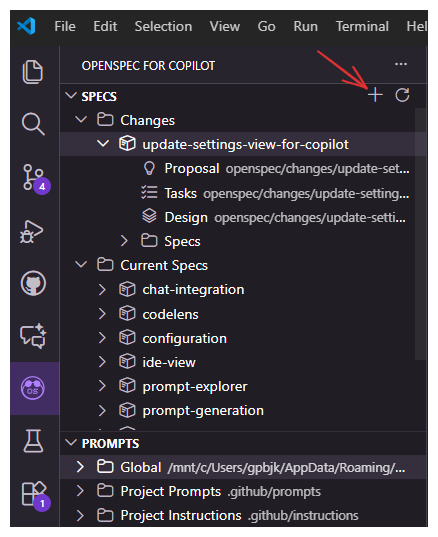
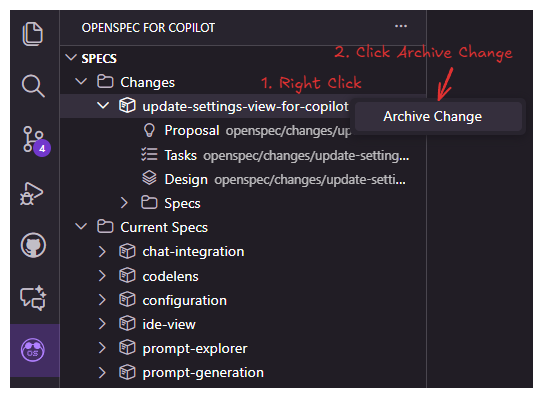

# OpenSpec for Agent

[](https://marketplace.visualstudio.com/items?itemName=bairui-dev.openspec-for-agent)
[](https://marketplace.visualstudio.com/items?itemName=bairui-dev.openspec-for-agent)
[](https://github.com/sevensky/spec-vscode-extensions/stargazers)
[](https://github.com/sevensky/spec-vscode-extensions/issues)

OpenSpec for Agent is a VS Code extension that brings Spec-Driven Development (SDD) to your workflow, leveraging [OpenSpec](https://github.com/Fission-AI/OpenSpec) prompts and chat agents like **GitHub Copilot Chat**.

It allows you to visually manage Specs, Steering documents (AGENTS.md), and custom prompts, seamlessly integrating with GitHub Copilot Chat by default, with optional support for **Codex Chat**, **Claude Code**, **Trae**, and **CodeBuddy**.



## Features

### 📝 Spec Management

- **Create Specs**: Run `OpenSpec for Agent: Create New Spec` (`openspec-for-agent.spec.create`) to open the creation dialog. Define your summary, product context, and constraints.
- **Generate with Chat**: The extension compiles your input into an optimized OpenSpec prompt and sends it to the configured chat agent (GitHub Copilot Chat by default) to generate the full specification (Requirements, Design, Tasks).
- **Manage Specs**: Browse generated specs in the **Specs** view.
- **Detailed Design**: Generate a detailed design document from a change, and update specs based on it.
- **Create GitHub Issue**: Generate a GitHub issue from a spec change, including references to proposal, design, and tasks.
- **Execute Tasks**: Open `tasks.md` and use the "Start Task" CodeLens to send task context to the configured chat agent for implementation.

### 🧩 Prompt Management
- **Custom Prompts**: Manage Markdown prompts under `.github/prompts` (configurable) alongside instructions and agents to keep all project guidance in one place.
- **Project Instructions & Agents**: The Prompts explorer now shows `Project Instructions` and `Project Agents` groups, surfacing `.github/instructions` and `.github/agents` files (in that order) so you can reference reusable instructions and agent definitions without leaving VS Code.
- **Run Prompts**: Execute prompts directly from the tree view, passing the context to the configured chat agent.
- **Rename or Delete**: Use the item context menu to rename or delete prompts, instructions, and agents without leaving the explorer. `Rename` always appears above `Delete` for quick edits.

## Installation

### Prerequisites
- Visual Studio Code 1.84.0 or newer.
- **[GitHub Copilot Chat](https://marketplace.visualstudio.com/items?itemName=GitHub.copilot-chat)** extension must be installed (default).
- For Codex mode, a VS Code extension that provides the `chatgpt.addToThread` command must be installed.
- **[OpenSpec](https://github.com/Fission-AI/OpenSpec)** must be globally installed and initialized.

### OpenSpec Global Installation and Initialization:

#### Step 1: Install the CLI globally

```shell
npm install -g @superkou/openspec@latest
```

Verify installation:

```shell
openspec --version
```

#### Step 2: Initialize OpenSpec in your project

Navigate to your project directory:

```shell
cd my-project
```

Run the initialization:

```shell
openspec init
```

## Migrating to OpenSpec v1

OpenSpec for Agent v1.0.0+ requires OpenSpec CLI v1. If you're upgrading from an earlier version:

### Prerequisites
- Node.js 18 or higher
- npm or yarn

### Migration Steps

1. **Install OpenSpec CLI v1:**
   ```bash
   npm install -g openspec@latest
   ```

2. **Initialize OpenSpec v1 in your workspace:**
   ```bash
   cd /path/to/your/workspace
   openspec init
   ```

3. **Verify prompt files were created:**
   Check that `.github/prompts/` contains:
   - `opsx-propose.prompt.md`
   - `opsx-apply.prompt.md`
   - `opsx-archive.prompt.md`
   - `opsx-continue.prompt.md`
   - `opsx-ff.prompt.md`
   - `opsx-explore.prompt.md`
   - `opsx-sync.prompt.md`
   - `opsx-verify.prompt.md`
   - `opsx-bulk-archive.prompt.md`
   - `opsx-onboard.prompt.md`

### Legacy File Support

The extension will temporarily use legacy v0.x prompt files if v1 files are not found, but will display deprecation warnings. Legacy support will be removed in a future release.

### Troubleshooting

**"OpenSpec v1 prompt files not found" error:**
- Ensure you've run `openspec init` in your workspace root
- Verify `.github/prompts/` directory exists
- Check that OpenSpec CLI is v1.0.0 or higher: `openspec --version`

**"Using legacy OpenSpec v0.x prompt file" warning:**
- Run `openspec init` to generate v1 files
- The extension will continue working with legacy files but will show warnings

### Marketplace
Search for "OpenSpec for Agent" in the VS Code Marketplace and install the extension.

### From Local VSIX
1. Build the package with `npm run package` (produces `openspec-for-agent-<version>.vsix`).
2. Install via `code --install-extension openspec-for-agent-<version>.vsix`.

## Usage

### 1. Create a Spec
1. Open the **Specs** view in the Activity Bar.
2. Click **Create New Spec**.
3. Fill in the details (Product Context is required).
4. Click **Create Spec**. This will open chat with a generated prompt.
5. Follow the chat instructions to generate the spec files.

   

### 2. Detailed Design Workflow (Optional)
1. Right-click on a Change ID in the **Specs** view.
2. Select **Create Detailed Design**. Chat will generate a detailed design document.
3. Once the design is finalized, right-click the change again and select **Update Specs from Detailed Design** to synchronize other documents.

### 3. Implement Tasks
1. Open a generated `tasks.md` file.
2. Click **Start All Tasks** above a checklist item.
3. Chat will open with the task context. Interact with it to implement the code.

   

### 4. Create GitHub Issue
1. Right-click on a Change ID in the **Specs** view.
2. Select **Create GitHub Issue** from the context menu.
3. Chat will open with a prompt to create a GitHub issue based on the spec documents.
4. Review the generated issue title and body, then create the issue.

### 5. Archive Change
1. Right-click on a Change ID in the **Specs** view.
2. Select **Archive Change** from the context menu.
3. The change will be moved to the archive.

   

## Configuration
All settings live under the `openspec-for-agent` namespace.

| Setting | Type | Default | Purpose |
| --- | --- | --- | --- |
| `aiAgent` | string | `github-copilot` | Select which chat agent to use for sending prompts (`github-copilot`, `codex`, `claude`, `trae`, or `codebuddy`). |
| `chatLanguage` | string | `English` | The language the agent should use for responses. Supports `Chinese (Simplified)` among others. |
| `copilot.specsPath` | string | `openspec` | Workspace-relative path for generated specs. |
| `copilot.promptsPath` | string | `.github/prompts` | Workspace-relative path for Markdown prompts. |
| `views.specs.visible` | boolean | `true` | Show or hide the Specs explorer. |
| `views.prompts.visible` | boolean | `true` | Toggle the Prompts explorer. |
| `views.steering.visible` | boolean | `true` | Toggle the Steering explorer. |
| `views.settings.visible` | boolean | `true` | Toggle the Settings overview. |
| `customInstructions.global` | string | `""` | Global custom instructions appended to all prompts. |
| `customInstructions.createSpec` | string | `""` | Custom instructions for "Create Spec". |
| `customInstructions.startAllTask` | string | `""` | Custom instructions for "Start All Tasks". |
| `customInstructions.archiveChange` | string | `""` | Custom instructions for "Archive Change". |
| `customInstructions.runPrompt` | string | `""` | Custom instructions for "Run Prompt". |

Note: In Codex mode, prompts are written to temporary Markdown files under `~/.codex/.tmp/` and sent via `chatgpt.addToThread`.

### Claude mode

When `aiAgent` is set to `claude`, the extension sends prompts to the **Claude Code CLI** via a terminal:

- Requires the `claude` CLI installed and on your PATH ([Claude Code](https://docs.anthropic.com/en/docs/claude-code)).
- Prompts are written to temporary Markdown files under `~/.claude/.tmp/` and dispatched with `claude "$(cat <file>)"` in a new terminal.
- If the `claude` binary is not found, an error message prompts you to install it or switch back to `github-copilot` / `codex`.
- Temporary files are cleaned up after 30 seconds (best-effort) and files older than 7 days are removed on each run.

### 简体中文 / Chinese (Simplified)

设置 `chatLanguage` 为 `Chinese (Simplified)` 后，每次发送 prompt 会追加 `请用简体中文回答。` 指令，模型将用简体中文回复。该设置对所有 agent（github-copilot / codex / claude / trae / codebuddy）均生效。

Setting `chatLanguage` to `Chinese (Simplified)` appends `请用简体中文回答。` to every prompt so the model responds in Simplified Chinese. This applies to all agents (github-copilot / codex / claude / trae / codebuddy).

Paths accept custom locations inside the workspace; the extension mirrors watchers to match custom directories.

## Workspace Layout
```
.github/
├── prompts/                # Markdown prompts
├── agents/                 # Project agent definitions surfaced in the Prompts view
openspec/
├── AGENTS.md               # Project-specific steering rules
├── project.md              # Project specification
├── <spec>/
│   ├── requirements.md
│   ├── design.md
│   └── tasks.md
LICENSE
src/
├── extension.ts            # Activation, command registration, tree providers
├── features/               # Spec and steering managers
├── providers/              # TreeDataProviders, CodeLens, webviews
├── services/               # Prompt loader (Handlebars templates)
├── utils/                  # Config manager, Copilot chat helpers
└── prompts/                # Prompt source markdown and generated TypeScript
webview-ui/                 # React + Vite webview bundle
scripts/
└── build-prompts.js        # Markdown → TypeScript prompt compiler
```

## Development
1. Install dependencies for both the extension and webview UI:
   - `npm run install:all`
2. Build prompts and bundle the extension:
   - `npm run build` (runs prompt compilation, extension bundle, and webview build)
3. Launch the development host:
   - Press `F5` inside VS Code or run the `Extension` launch configuration.
4. Live development:
   - `npm run watch` (TypeScript watch + webview dev server)
   - `npm --prefix webview-ui run dev` (webview in isolation)
5. Generate prompt modules when editing markdown under `src/prompts`:
   - `npm run build-prompts`

### Testing and Quality
- Unit tests: `npm test`, `npm run test:watch`, or `npm run test:coverage` (Vitest).
- Linting, formatting, and static checks: `npm run lint`, `npm run format`, `npm run check` (Ultracite toolchain).

### Packaging
- Produce a VSIX with `npm run package` (requires `vsce`).
- The output bundle lives in `dist/extension.js`; webview assets emit to `dist/webview/app/`.

### Linked Extension Mode (No VSIX, No F5)

For local development where you want the extension auto-loaded in **any workspace** (without opening this project, without packaging a `.vsix`, and without pressing `F5`), symlink the project directory into the VS Code/Trae extensions folder.

The helper script `scripts/link-extension.sh` manages this for you:

```bash
# Create the symlink (replaces any previously installed .vsix version)
pnpm link:ext

# Check current mode (symlink vs static vsix directory)
pnpm ext:status

# Remove the symlink (restore .vsix install mode if needed)
pnpm unlink:ext
```

How it works:

```
<extensions-dir>/bairui-dev.openspec-for-agent-1.1.0-universal
    ↓ symlink
<project-dir>/  ← contains dist/extension.js produced by `pnpm build`
```

After linking:
1. Open any workspace in VS Code/Trae — the extension loads automatically.
2. After code changes: run `pnpm build`, then `Ctrl+Shift+P` → `Reload Window`.
3. The extension directory can be overridden via the `TRAPE_EXTENSIONS_DIR` environment variable (defaults to `/root/.trae-cn-server/extensions`).

Notes:
- VS Code scans the entire symlinked directory (including `node_modules`), so startup may be slightly slower — functionality is unaffected.
- If changes don't appear after `pnpm build`, use `Reload Window` rather than restarting the editor process.

## License
MIT License. See [`LICENSE`](LICENSE).

## Credits
Based on [OpenSpec](https://github.com/Fission-AI/OpenSpec) by Fission AI.
Originally forked from [kiro-for-codex-ide](https://github.com/notdp/kiro-for-codex-ide).
