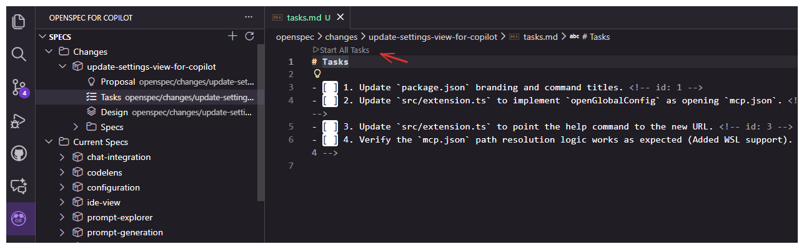

# OpenSpec for Copilot

[](https://marketplace.visualstudio.com/items?itemName=atman-dev.openspec-for-copilot)
[](https://marketplace.visualstudio.com/items?itemName=atman-dev.openspec-for-copilot)
[](https://github.com/atman-33/openspec-for-copilot/stargazers)
[](https://github.com/atman-33/openspec-for-copilot/issues)

OpenSpec for Copilot 是一款 VS Code 扩展，将规范驱动开发（SDD）引入你的工作流，基于 [OpenSpec](https://github.com/Fission-AI/OpenSpec) 提示词与聊天 agent（如 **GitHub Copilot Chat**）协同工作。

它可以可视化地管理 Spec、Steering 文档（AGENTS.md）以及自定义提示词，默认与 GitHub Copilot Chat 无缝集成，同时可选支持 **Codex Chat**、**Claude Code**、**Trae**、**CodeBuddy** 等 agent。


## 功能特性

### 📝 Spec 管理

- **创建 Spec**：运行 `OpenSpec for Copilot: Create New Spec`（`openspec-for-copilot.spec.create`）打开创建对话框，填写摘要、产品上下文与约束。
- **通过 Chat 生成**：扩展将你的输入编译为优化的 OpenSpec 提示词，发送到配置的 chat agent（默认 GitHub Copilot Chat），生成完整的规范文档（需求、设计、任务）。
- **管理 Spec**：在 **Specs** 视图中浏览已生成的 spec。
- **详细设计**：从某个变更生成详细设计文档，并基于该文档同步更新 specs。
- **创建 GitHub Issue**：从 spec 变更生成 GitHub issue，包含对 proposal、design、tasks 的引用。
- **执行任务**：打开 `tasks.md`，使用 "Start Task" CodeLens 将任务上下文发送到配置的 chat agent 进行实现。

### 🧩 提示词管理
- **自定义提示词**：管理 `.github/prompts`（可配置）下的 Markdown 提示词，连同 instructions 和 agents 一起，将所有项目指引集中管理。
- **项目 Instructions 与 Agents**：Prompts 视图新增 `Project Instructions` 和 `Project Agents` 分组，展示 `.github/instructions` 与 `.github/agents` 文件，无需离开 VS Code 即可引用可复用的指令和 agent 定义。
- **运行提示词**：直接从树视图执行提示词，将上下文传递给配置的 chat agent。
- **重命名或删除**：使用条目右键菜单即可重命名或删除 prompts、instructions、agents。`Rename` 始终位于 `Delete` 之上，便于快速编辑。

## 安装

### 前置条件
- Visual Studio Code 1.84.0 或更高版本。
- 必须安装 **[GitHub Copilot Chat](https://marketplace.visualstudio.com/items?itemName=GitHub.copilot-chat)** 扩展（默认 agent）。
- Codex 模式需安装提供 `chatgpt.addToThread` 命令的 VS Code 扩展。
- 必须全局安装并初始化 **[OpenSpec](https://github.com/Fission-AI/OpenSpec)**。

### OpenSpec 全局安装与初始化：

#### 步骤 1：全局安装 CLI

```shell
npm install -g @fission-ai/openspec@latest
```

验证安装：

```shell
openspec --version
```

#### 步骤 2：在项目中初始化 OpenSpec

进入项目目录：

```shell
cd my-project
```

执行初始化：

```shell
openspec init
```

## 迁移到 OpenSpec v1

OpenSpec for Copilot v1.0.0+ 要求 OpenSpec CLI v1。若从早期版本升级：

### 前置条件
- Node.js 18 或更高
- npm 或 yarn

### 迁移步骤

1. **安装 OpenSpec CLI v1：**
   ```bash
   npm install -g openspec@latest
   ```

2. **在工作区初始化 OpenSpec v1：**
   ```bash
   cd /path/to/your/workspace
   openspec init
   ```

3. **验证提示词文件已生成：**
   检查 `.github/prompts/` 是否包含：
   - `opsx-propose.prompt.md`
   - `opsx-apply.prompt.md`
   - `opsx-archive.prompt.md`
   - `opsx-continue.prompt.md`
   - `opsx-ff.prompt.md`
   - `opsx-explore.prompt.md`
   - `opsx-sync.prompt.md`
   - `opsx-verify.prompt.md`
   - `opsx-bulk-archive.prompt.md`
   - `opsx-onboard.prompt.md`

### 旧版文件支持

若未找到 v1 文件，扩展会临时使用旧版 v0.x 提示词文件，但会显示弃用警告。旧版支持将在未来版本中移除。

### 故障排查

**"OpenSpec v1 prompt files not found" 错误：**
- 确保在工作区根目录执行过 `openspec init`
- 验证 `.github/prompts/` 目录存在
- 检查 OpenSpec CLI 版本为 1.0.0 或更高：`openspec --version`

**"Using legacy OpenSpec v0.x prompt file" 警告：**
- 运行 `openspec init` 生成 v1 文件
- 扩展会继续使用旧版文件工作，但会显示警告

### 应用市场
在 VS Code Marketplace 搜索 "OpenSpec for Copilot" 并安装扩展。

### 从本地 VSIX 安装
1. 使用 `npm run package` 构建包（生成 `openspec-for-copilot-<version>.vsix`）。
2. 通过 `code --install-extension openspec-for-copilot-<version>.vsix` 安装。

## 使用方式

### 1. 创建 Spec
1. 在活动栏打开 **Specs** 视图。
2. 点击 **Create New Spec**。
3. 填写详情（Product Context 为必填项）。
4. 点击 **Create Spec**，将打开 chat 并发送生成的提示词。
5. 按 chat 指引生成 spec 文件。

   

### 2. 详细设计工作流（可选）
1. 在 **Specs** 视图中右键点击某个 Change ID。
2. 选择 **Create Detailed Design**，chat 将生成详细设计文档。
3. 设计定稿后，再次右键该变更并选择 **Update Specs from Detailed Design** 同步其他文档。

### 3. 执行任务
1. 打开生成的 `tasks.md` 文件。
2. 点击清单项上方的 **Start All Tasks**。
3. chat 将打开并携带任务上下文，与之交互以实现代码。

   

### 4. 创建 GitHub Issue
1. 在 **Specs** 视图中右键点击某个 Change ID。
2. 从上下文菜单选择 **Create GitHub Issue**。
3. chat 将打开并携带基于 spec 文档生成 GitHub issue 的提示词。
4. 审核生成的 issue 标题与正文，然后创建 issue。

### 5. 归档变更
1. 在 **Specs** 视图中右键点击某个 Change ID。
2. 从上下文菜单选择 **Archive Change**。
3. 该变更将被移动到归档目录。

   

## 配置
所有设置位于 `openspec-for-copilot` 命名空间下。

| 设置项 | 类型 | 默认值 | 用途 |
| --- | --- | --- | --- |
| `aiAgent` | string | `github-copilot` | 选择用于发送提示词的 chat agent（`github-copilot`、`codex`、`claude`、`trae`、`codebuddy`）。 |
| `chatLanguage` | string | `English` | agent 回复使用的语言，支持 `Chinese (Simplified)` 等。 |
| `copilot.specsPath` | string | `openspec` | 生成 specs 的工作区相对路径。 |
| `copilot.promptsPath` | string | `.github/prompts` | Markdown 提示词的工作区相对路径。 |
| `views.specs.visible` | boolean | `true` | 显示或隐藏 Specs 浏览器。 |
| `views.prompts.visible` | boolean | `true` | 切换 Prompts 浏览器。 |
| `views.steering.visible` | boolean | `true` | 切换 Steering 浏览器。 |
| `views.settings.visible` | boolean | `true` | 切换 Settings 概览。 |
| `customInstructions.global` | string | `""` | 追加到所有提示词的全局自定义指令。 |
| `customInstructions.createSpec` | string | `""` | "Create Spec" 的自定义指令。 |
| `customInstructions.startAllTask` | string | `""` | "Start All Tasks" 的自定义指令。 |
| `customInstructions.archiveChange` | string | `""` | "Archive Change" 的自定义指令。 |
| `customInstructions.runPrompt` | string | `""` | "Run Prompt" 的自定义指令。 |

注：Codex 模式下，提示词会写入 `~/.codex/.tmp/` 下的临时 Markdown 文件，并通过 `chatgpt.addToThread` 发送。

### Claude 模式

当 `aiAgent` 设为 `claude` 时，扩展通过终端向 **Claude Code CLI** 发送提示词：

- 需安装 `claude` CLI 并加入 PATH（[Claude Code](https://docs.anthropic.com/en/docs/claude-code)）。
- 提示词写入 `~/.claude/.tmp/` 下的临时 Markdown 文件，并在新终端中以 `claude "$(cat <file>)"` 方式发送。
- 若未找到 `claude` 可执行文件，会提示你安装或切回 `github-copilot` / `codex`。
- 临时文件在 30 秒后清理（尽力而为），每次运行时会删除超过 7 天的旧文件。

### 简体中文

将 `chatLanguage` 设为 `Chinese (Simplified)` 后，每次发送 prompt 会追加 `请用简体中文回答。` 指令，模型将用简体中文回复。该设置对所有 agent（github-copilot / codex / claude / trae / codebuddy）均生效。

路径支持工作区内的自定义位置；扩展会镜像 watcher 以匹配自定义目录。

## 工作区结构
```
.github/
├── prompts/                # Markdown 提示词
├── agents/                 # Prompts 视图中展示的项目 agent 定义
openspec/
├── AGENTS.md               # 项目特定的 steering 规则
├── project.md              # 项目规范
├── <spec>/
│   ├── requirements.md
│   ├── design.md
│   └── tasks.md
LICENSE
src/
├── extension.ts            # 激活、命令注册、tree providers
├── features/               # Spec 与 steering 管理器
├── providers/              # TreeDataProviders、CodeLens、webviews
├── services/               # Prompt loader（Handlebars 模板）
├── utils/                  # 配置管理器、Copilot chat 辅助函数
└── prompts/                # 提示词源 markdown 与生成的 TypeScript
webview-ui/                 # React + Vite webview bundle
scripts/
└── build-prompts.js        # Markdown → TypeScript 提示词编译器
```

## 开发
1. 为扩展与 webview UI 安装依赖：
   - `npm run install:all`
2. 构建提示词并打包扩展：
   - `npm run build`（执行提示词编译、扩展打包、webview 构建）
3. 启动开发宿主：
   - 在 VS Code 中按 `F5` 或运行 `Extension` 启动配置。
4. 实时开发：
   - `npm run watch`（TypeScript watch + webview dev server）
   - `npm --prefix webview-ui run dev`（独立运行 webview）
5. 编辑 `src/prompts` 下的 markdown 后生成提示词模块：
   - `npm run build-prompts`

### 测试与质量
- 单元测试：`npm test`、`npm run test:watch` 或 `npm run test:coverage`（Vitest）。
- Lint、格式化与静态检查：`npm run lint`、`npm run format`、`npm run check`（Ultracite 工具链）。

### 打包
- 使用 `npm run package` 生成 VSIX（需 `vsce`）。
- 输出 bundle 位于 `dist/extension.js`；webview 资源输出到 `dist/webview/app/`。

### 软链接开发模式（无需 VSIX，无需 F5）

本地开发时，若希望扩展在**任意工作区**自动加载（既不打开本项目、也不打包 `.vsix`、更不必按 `F5`），可将项目目录软链接到 VS Code/Trae 的扩展目录。

辅助脚本 `scripts/link-extension.sh` 可一键管理：

```bash
# 创建软链接（会替换此前通过 .vsix 安装的版本）
pnpm link:ext

# 查看当前模式（软链接 vs 静态 vsix 目录）
pnpm ext:status

# 移除软链接（如需恢复 .vsix 安装模式）
pnpm unlink:ext
```

工作原理：

```
<extensions-dir>/atman-dev.openspec-for-copilot-1.1.0-universal
    ↓ 软链接
<project-dir>/  ← 包含 pnpm build 生成的 dist/extension.js
```

链接后：
1. 在 VS Code/Trae 中打开任意工作区，扩展将自动加载。
2. 代码改动后：执行 `pnpm build`，然后 `Ctrl+Shift+P` → `Reload Window`。
3. 扩展目录可通过环境变量 `TRAPE_EXTENSIONS_DIR` 覆盖（默认 `/root/.trae-cn-server/extensions`）。

注意事项：
- VS Code 会扫描整个软链接目录（含 `node_modules`），启动可能略慢，但不影响功能。
- 若 `pnpm build` 后改动未生效，请使用 `Reload Window` 而非重启编辑器进程。

## License
MIT License. See [`LICENSE`](LICENSE).

## Credits
基于 Fission AI 的 [OpenSpec](https://github.com/Fission-AI/OpenSpec)。
最初 fork 自 [kiro-for-codex-ide](https://github.com/notdp/kiro-for-codex-ide)。
